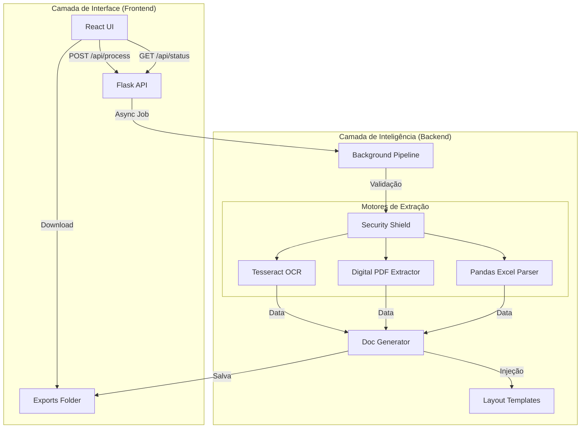

# 📄 Automação OCR & Document Hub - Hub de Inteligência Técnica

O **Automation Project** é uma plataforma desktop de automação industrial que converte arquivos estruturados e não estruturados (PDFs, Imagens, Excel) em relatórios técnicos profissionais formatados em Word (.docx). 

Utiliza as tecnologias mais modernas de visão computacional e extração digital para garantir precisão e velocidade na geração de laudos laboratoriais.

---

## 🏗️ 1. Arquitetura Geral do Projeto

O sistema é dividido em duas grandes camadas que se comunicam via API REST local:



### Principais Componentes
- **Backend (Python/Flask)**: Orquestrador da lógica de negócio e motores de processamento.
- **Frontend (React/Vite)**: Interface moderna com feedback em tempo real do processamento.
- **Desktop Bridge (PyWebView)**: Envelopa a aplicação web em uma janela nativa do Windows.

---

## ⚙️ 2. Como Configurar o Ambiente de Desenvolvimento

Siga os passos abaixo para preparar sua máquina para contribuir com o projeto:

### 2.1 Backend (Python 3.10+)

1.  Navegue para a pasta `backend/`.
2.  Crie e ative o ambiente virtual:
    ```bash
    python -m venv venv
    .\venv\Scripts\activate
    ```
3.  Instale as dependências:
    ```bash
    pip install -r requirements.txt
    ```
4.  **Pré-requisitos Externos (Obrigatório)**:
    - Instale o **Tesseract OCR** em `C:\Program Files\Tesseract-OCR\`.
    - Instale o **Poppler** (necessário para PDFs) em `C:\poppler\`.
5.  Inicie o servidor e a UI Desktop:
    ```bash
    python main.py
    ```

### 2.2 Frontend (Node.js 18+)

1.  Navegue para a pasta `frontend/`.
2.  Instale as dependências com suporte a pacotes legados (se necessário):
    ```bash
    npm install --legacy-peer-deps
    ```
3.  Inicie o servidor de desenvolvimento do Vite:
    ```bash
    npm run dev
    ```
    *Acesse em `http://localhost:5173` para ver as mudanças em tempo real.*

---

## 🛠️ 3. Tecnologias e Bibliotecas Core

| Camada | Tecnologia | Função Principal |
| :--- | :--- | :--- |
| **UI** | React / Tailwind | Interface reativa e estilização moderna. |
| **API** | Flask / RESTX | Endpoints de processamento e documentação Swagger. |
| **OCR** | Tesseract / Pillow | Leitura de imagens e PDFs escaneados. |
| **PDF** | Pdfminer.six | Extração direta de texto e metadados de PDFs digitais. |
| **Doc** | Python-docx | Criação e manipulação de arquivos Word complexos. |
| **Excel** | Pandas / Openpyxl | Mineração de dados em planilhas de grande volume. |
| **Segurança** | Libmagic | Validação binária de tipos de arquivos (MIME Check). |

---

## 📂 4. Mapa Detalhado do Repositório

- **`/backend`**: Hub inteligente de processamento.
  - Veja o **[⚙️ Manual do Backend](backend/README.md)** para detalhes sobre a lógica de extração.
- **`/frontend`**: Interface moderna e painel de controle.
- **`/storage`**: O diretório de persistência local:
  - `/layout`: Onde residem os modelos `.docx` (Mala Direta).
  - `/uploads`: Pasta temporária para arquivos recebidos.
  - `/exports`: Onde os relatórios prontos são armazenados para download.
- **`/docs`**: Manuais de usuário e diagramas de arquitetura.

---

## 🚀 5. Empacotamento para Usuário Final (.exe)

O projeto utiliza o **PyInstaller** para converter os scripts em um executável autônomo para Windows:

```bash
# Execute na raiz do projeto
pyinstaller --noconfirm --onefile --windowed \
--name "Automation_Project" \
--distpath "desktop" \
--add-data "backend/storage;storage" \
--add-data "frontend/dist;frontend/dist" \
--hidden-import "clr" \
backend/run_desktop.py
```

---
*Este projeto visa reduzir o tempo de geração de laudos técnicos de 40 minutos para menos de 10 segundos.*
