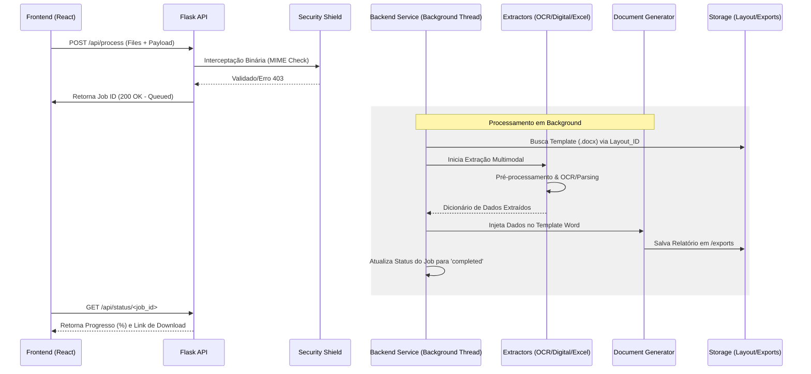

# ⚙️ Manual Avançado de Engenharia do Backend - OCR & Doc Engine

Este documento é o roteiro técnico definitivo para o **Automation Project**. Foi concebido para guiar engenheiros de software e analistas de sistemas na compreensão, manutenção e expansão do núcleo inteligente da plataforma.

---

## 🏛️ 1. Arquitetura do Sistema e Fluxo de Dados

O backend opera como um **Hub de Processamento Assíncrono**, garantindo que operações pesadas de OCR ou cálculos de Excel não bloqueiem a interface do usuário.

### 🔄 Diagrama de Sequência do Pipeline

---

## 🔬 2. Módulos de Extração e Inteligência

### 👁️ 2.1 Motor OCR (`services/ocr_service.py`)
Utilizado quando a extração digital falha ou para imagens (PNG/JPG).
- **Pré-processamento Dinâmico**: Antes da leitura, a imagem sofre um *upscale* (Lanczos), conversão para cinza e ajuste de contraste (fator 2.0). Isso reduz drasticamente o erro em fontes pequenas.
- **Lógica de Âncoras e ROIs (Regiões de Interesse)**:
  - O sistema busca termos fixos (âncoras) no dicionário gerado pelo Tesseract.
  - Ao encontrar a âncora "AWB", ele define um retângulo dinâmico à direita `(x + w + 5, y - 10)` para capturar apenas o valor do código, ignorando cabeçalhos e rodapés.
- **Debug Visual**: Habilita o salvamento de imagens em `storage/debug` mostrando as caixas de detecção (Azul para Âncoras, Verde para Valores).

### 📄 2.2 Extração Digital (`services/pdfExtract_service.py`)
Atua diretamente nos objetos internos do PDF.
- **Checkbox Logic**: O motor identifica glifos como `[X]`, `☑` ou `R` e mapeia para valores booleanos, permitindo que o sistema saiba se um teste foi "Aprovado" ou "Reprovado" sem OCR.

### 📊 2.3 Fábrica de Parsers Excel (`services/excel_parsers/`)
Implementa o padrão **Strategy** via `factory.py`.
- **Parser ASE**: Especialista em ler tabelas de frequências e picos, filtrando apenas valores acima do "Limit Line".
- **Parser Default**: Um leitor genérico de células baseado em coordenadas fixas definidas no layout.

---

## 🛡️ 3. Blindagem e Confiabilidade

### 🧬 3.1 MIME Sanitization (`utils/security.py`)
Proteção contra ataques de injeção de arquivos.
1.  **Header Peek**: O sistema lê os primeiros 2048 bytes do buffer do arquivo *antes* de salvá-lo em disco.
2.  **Magic Numbers**: Utiliza a biblioteca `python-magic` para verificar se o conteúdo binário corresponde à extensão declarada. 
3.  **Resultado**: Se um usuário tentar subir um executável oculto em um PDF, o sistema lança uma `SecurityException` imediatamente.

### 🧹 3.2 Gestão de Ciclo de Vida (`utils/scheduler.py`)
Para evitar o transbordamento do storage, um agendador (`BackgroundScheduler`) executa a cada 30 minutos:
- Deleta arquivos em `/uploads` com mais de 1 hora.
- Deleta relatórios em `/exports` após o download ou expiração.

---

## 👨‍💻 4. Guia do Desenvolvedor: Expansão do Sistema

### 🆕 Como Criar um Novo Tipo de Ensaio?
1.  **Layout**: Crie um `.docx` com tags (ex: `[cliente_nome]`) e salve em `storage/layout`.
2.  **Parser (Opcional)**: Se for Excel, crie um novo parser em `services/excel_parsers/` e registre-o no `factory.py`.
3.  **Regex**: Adicione os novos padrões de captura em `utils/document_tags.py`.

### 🔍 Ajustando a Sensibilidade do OCR
Caso o Tesseract falhe em ler certas fontes:
- Altere o `config` do Tesseract no `ocr_service.py` (ex: mudar `--psm 6` para `--psm 4` para layouts em colunas).
- Ajuste o fator de contraste na linha onde `ImageEnhance.Contrast` é invocado.

---

## ⚙️ 5. Configurações Profissionais (`config_loader.py`)

As configurações seguem a filosofia **12-Factor App** via arquivo `.env`:
- `DEBUG`: Alterne para `False` em produção para desativar o console do PyWebView.
- `HTTP_PORT`: Porta padrão 5000 (Flask).
- `LOG_LEVEL`: Defina como `DEBUG` para rastrear cada passo da extração ou `INFO` para produção.

---

## ❓ 6. Solução de Problemas Técnicos (Troubleshooting)

| Erro | Causa Provável | Solução |
| :--- | :--- | :--- |
| `SEC_01` | Assinatura binária do arquivo inválida. | Verifique se o arquivo não está corrompido ou é um binário camuflado. |
| `SYS_01` | Falha não tratada no pipeline. | Verifique o Traceback completo no arquivo `logs/app.log`. |
| `Tesseract Not Found` | Caminho do executável errado. | Atualize a variável `self.tesseract_cmd` em `services/ocr_service.py`. |
| Relatório Vazio | Tags no Word não batem com chaves do dicionário. | Verifique em `utils/document_tags.py` se as chaves das Regex são idênticas às tags do `.docx`. |

---
*Este manual visa a transparência total do processo de automação, garantindo que o sistema seja auditável e expansível.*
